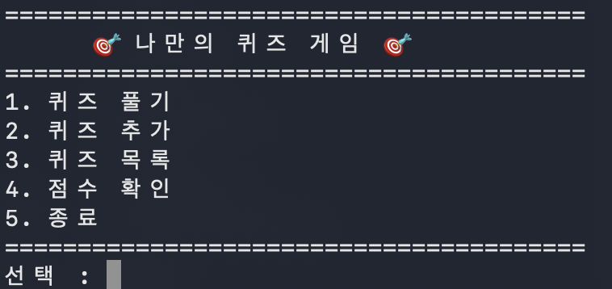
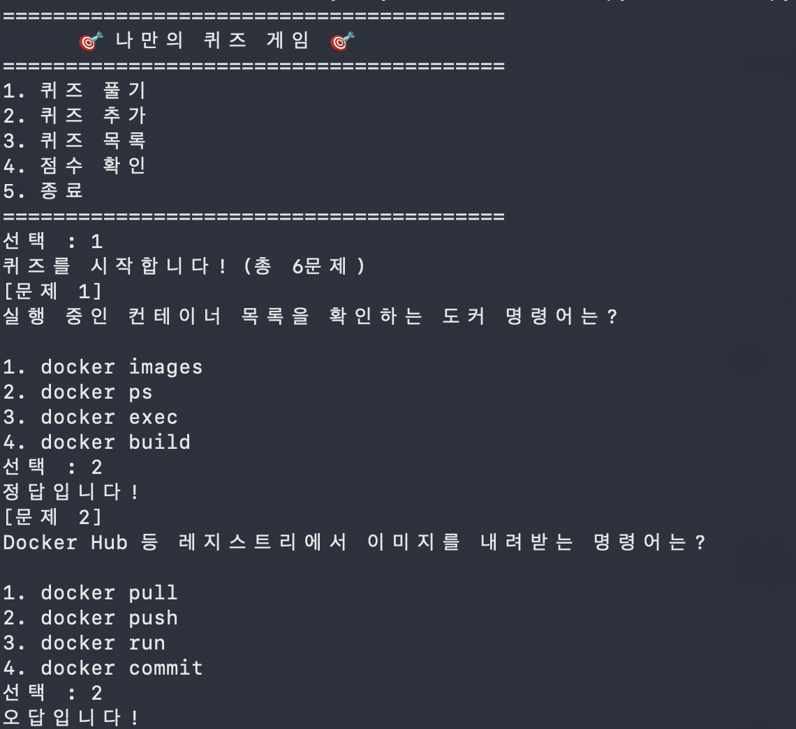
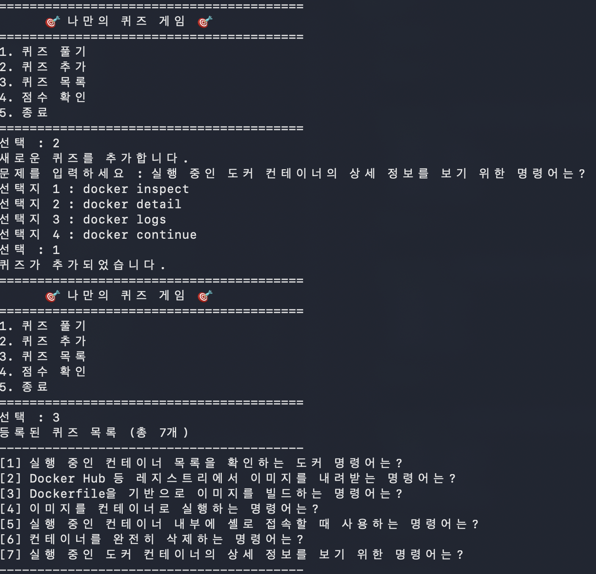
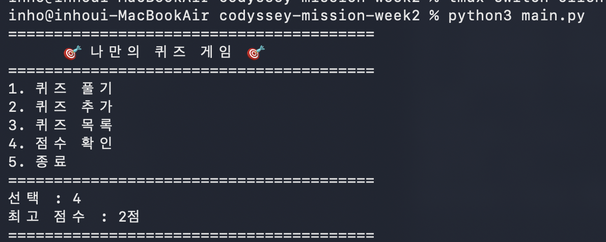

# Docker 퀴즈 게임
# git pull test용

## 프로젝트 개요

터미널에서 실행하는 나만의 퀴즈 게임입니다. 메뉴에서 번호를 선택해 퀴즈를 풀고, 새 퀴즈를 등록하고, 등록된 퀴즈 목록과 최고 점수를 확인할 수 있습니다. 퀴즈 데이터와 최고 점수는 `state.json` 파일에 저장되어 프로그램을 종료하고 다시 실행해도 유지됩니다.

## 퀴즈 주제 선정 이유

최근 Docker를 배우면서 헷갈리는 명령어가 많아, 이를 퀴즈로 만들어 직접 풀어보며 복습하기 위해 Docker 명령어를 주제로 선택했습니다.

## 실행 방법

```bash
python3 main.py
```

Python 3.10 이상, 외부 라이브러리 없이 표준 라이브러리만 사용합니다.

## 기능 목록

- **퀴즈 풀기**: 등록된 퀴즈를 순서대로 출제하고, 정답/오답을 알려준 뒤 최종 점수를 보여줍니다. 최고 점수를 갱신하면 `state.json`에 저장합니다.
- **퀴즈 추가**: 문제, 선택지 4개, 정답 번호(1~4)를 입력받아 새 퀴즈를 등록하고 즉시 저장합니다.
- **퀴즈 목록**: 등록된 퀴즈의 문제 목록을 번호와 함께 보여줍니다.
- **점수 확인**: 저장된 최고 점수를 확인합니다. 아직 퀴즈를 푼 기록이 없으면 안내 메시지를 보여줍니다.
- **종료**: 게임을 안전하게 종료합니다. `Ctrl+C`(KeyboardInterrupt), 입력 스트림 종료(EOFError) 상황에서도 비정상 종료 없이 안내 메시지를 출력하고 종료합니다.

모든 숫자 입력은 앞뒤 공백 제거, 빈 입력, 숫자 변환 실패, 허용 범위 밖 입력을 검증하고 안내 메시지 후 재입력을 받습니다.

## 파일 구조

```
codyssey-mission-week2/
├── main.py              # 프로그램 진입점 (QuizGame 실행)
├── quiz.py              # Quiz 클래스 (문제/선택지/정답)
├── quiz_game.py          # QuizGame 클래스 (메뉴, 게임 진행, 저장/불러오기)
├── state.json            # 퀴즈 데이터 및 최고 점수 저장 파일 (자동 생성, git 추적 제외)
├── docs/
│   ├── TROUBLESHOOTING.md  # 개발 중 겪은 이슈 및 해결 기록
│   └── screenshots/        # 실행 화면 스크린샷
├── .gitignore
└── README.md
```

## 데이터 파일 설명 (`state.json`)

프로젝트 루트에 UTF-8로 인코딩되어 저장됩니다. 최초 실행 시 파일이 없으면 기본 퀴즈 데이터(Docker 명령어 6문항)로 시작하며, 퀴즈 추가 또는 최고 점수 갱신 시마다 갱신되어 저장됩니다. 파일이 손상된 경우에는 안내 메시지를 출력하고 기본 퀴즈 데이터로 초기화합니다.

스키마:

```json
{
  "quizzes": [
    {
      "question": "실행 중인 컨테이너 목록을 확인하는 도커 명령어는?",
      "choices": ["docker images", "docker ps", "docker exec", "docker build"],
      "answer": 2
    }
  ],
  "best_score": 4
}
```

- `quizzes`: 퀴즈 목록. 각 항목은 `question`(문제), `choices`(선택지 4개), `answer`(정답 번호, 1~4)로 구성됩니다.
- `best_score`: 지금까지 퀴즈를 풀어서 얻은 최고 점수(맞춘 문제 수)입니다.

## 실행 화면

| 메뉴 | 퀴즈 풀기 |
| --- | --- |
|  |  |

| 퀴즈 추가 | 점수 확인 |
| --- | --- |
|  |  |
